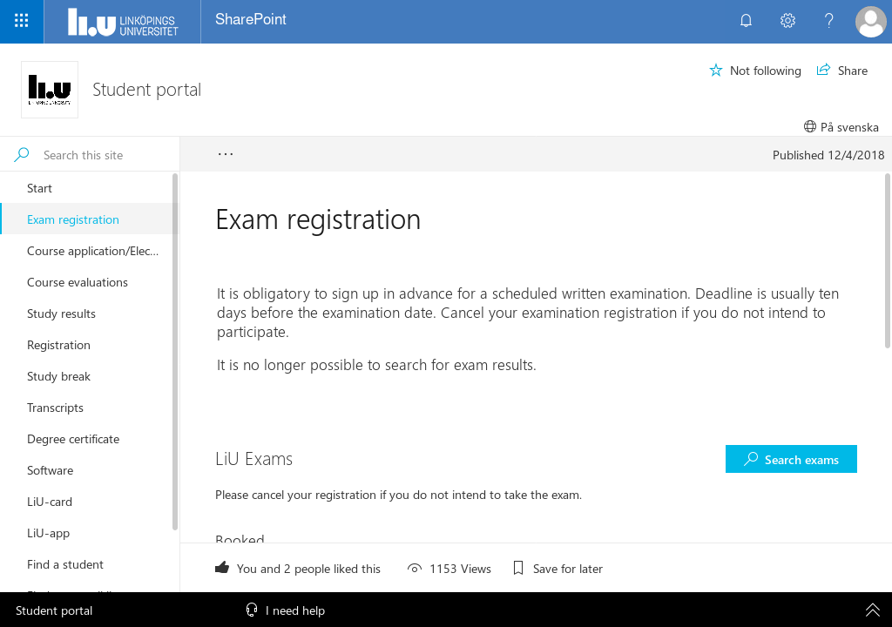
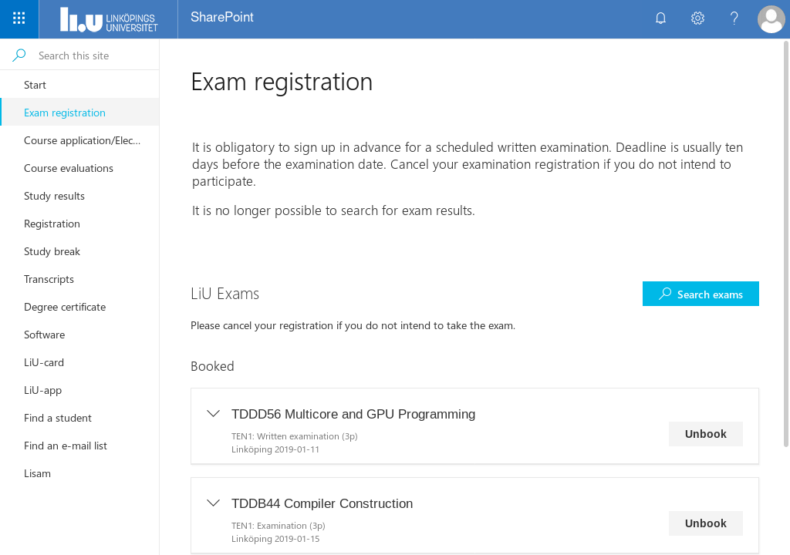
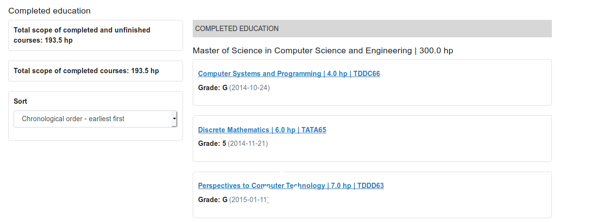
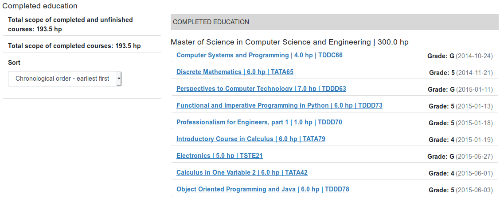

# Make lisam a bit more bearable

We all know Lisam is horrible software, a lot of it can't be changed but a big problem,
at least on smaller screen is the amount of screen real estate taken up by static uncationable or pointless things.
For example, there is a like button on the exam registration page...

### Before

### After

## ⚠ Warning

This userstyle **hides functionality** which is *currently* mostly pointless, such
as the like button. Howerver, it also hides some useful things like the button to **change language**.

Furthermore, this userstyle is a hack which relies on the structure of lisam and microsoft
sharepoint, it might break or cause strange issues because of incorrect
assumptions or LIU/microsoft changes. **If things break on lisam or some other
sharepoint site**, try disabling the userstyle. If that does help, feel free to
report an issue in this github repo detailing what broke and I will try and fix
it.

## Installation

Before you begin, read the warning above and make sure you know what you're doing.

First, install a browser extension that supports userstyles, [Stylus](https://add0n.com/stylus.html) is a good choice.

Then, open the [raw version of the not-so-shit-lisam.user.css](https://github.com/TheZoq2/not-so-shit-lisam/raw/master/not-so-shit-lisam.user.css).
Finally click "install style" and enjoy being slightly less annoyed at the stupidity
that is Lisam.

## More screenshots

### Old grade page

### Updated grade page

